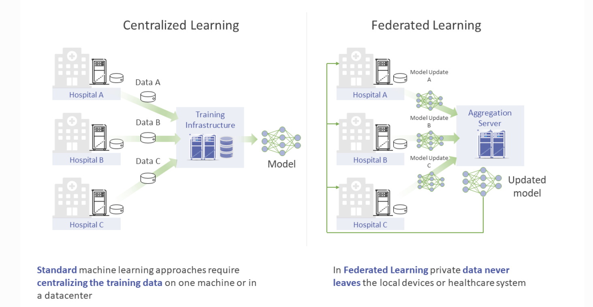
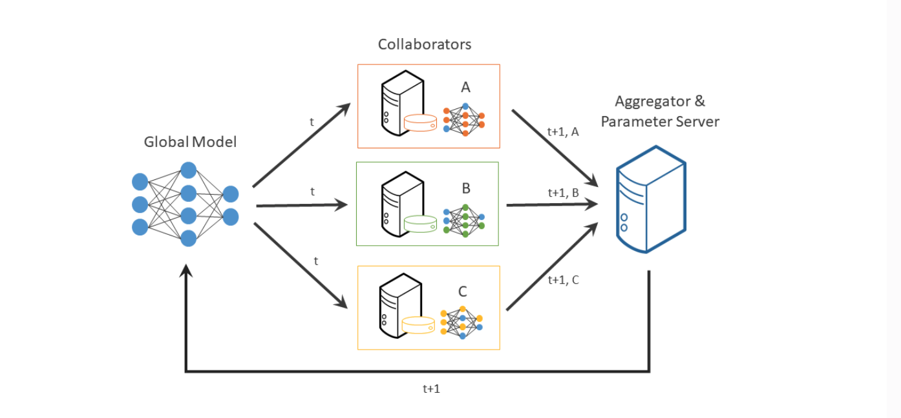

# Federated Learning

## What is Federated Learning?

### Challenges of Centralized Machine Learning

- Data Privacy/Security

- Efficiency(Bandwidth and Storage)

- Examples:

  - Sensitive healthcare records from multiple hospitals to train cancer detection models

  - Financial information from different organizations to detect financial fraud

  - Location data from your electric car to make better range prediction

  - End-to-end encrypted messages to train better auto-complete models

### Definitions

Instead of moving the data to the computation, the FL moves the computation to the data.

*Federated learning is a distributed machine learning approach that enables collaboration on machine learning projects without sharing sensitive data.*

#### Collaborator

- Edge devices like smartphones
- Servers belongs to organizations

#### Aggregator

- Combine all the model updates from the Collaborator to one single model
- The most basic way to do it is called [Federated Averaging](https://arxiv.org/abs/1602.05629)

#### Round

The following step 1 to 5 are what we call a single round of FL. 

1. Initialize global model
2. Send model to the connected collaborators
3. Train the model with the local data
4. Return model updates back to the sever
5. Aggregate the model updates into a new global model

*Repeat the above training process/steps over and over again to eventually arrive at a fully trained model that performs well across the data of all client nodes*

## Frameworks

### Flower Vs OpenFL

| Criteria              | Flower                                             | OpenFL                                             |
|-----------------------|----------------------------------------------------|----------------------------------------------------|
| **GitHub Stars**      |  |  |
| **Forks**             |  |  |
| **Contributors**      |  |  |
| **Watchers**           |  |  |
| **Creation Date**     | March 25, 2020                                     | December 4, 2019                                   |
| **Latest Release Date** |  |  |
| **Documentation**     | [Flower Documentation](https://flower.dev/docs/)   | [OpenFL Documentation](https://openfl.readthedocs.io/) |
| **Features**          | - Support for multiple ML libraries (TensorFlow, PyTorch, etc.)  - Customizable federated learning strategies  - Extensive ecosystem  - Cross-silo and cross-device federated learning | - Collaborative training across organizations  - Extensible and modular  - Secure and privacy-preserving  - Optimized for Intel technologies |
| **Community**         | Growing community with active contributions        | Strong enterprise focus with Intel backing         |
| **Deployment**        | Easy deployment in cloud, edge, and hybrid setups  | Enterprise integration with Intel hardware and software |
| **Security Features** | Basic security and privacy-preserving techniques   | Emphasizes secure multi-party computations and privacy-preserving techniques |
| **Focus**             | Broad focus on federated learning use cases        | Strong enterprise focus with an emphasis on security and privacy |
| **Programming Language** | Python                                            | Python                                             |

**Note**

Flower is user-friendly for migrating from centralized to federated learning and integrates with various ML frameworks. A notable achievement is training [a billion-scale LLM with Flower](https://arxiv.org/html/2405.10853v1). This is also a reflection of its increased activity.

OpenFL, on the other hand, offers built-in secure communication between the Aggregator and Collaborators. It provides detailed user control, such as creating a Federation Plan. I personally appreciate the [Task AP](https://openfl.readthedocs.io/en/latest/about/features_index/taskrunner.html)I, which gives users flexibility in controlling which tasks are sent to collaborators.

## Reference

- [OpenFL Overview](https://openfl.readthedocs.io/en/latest/about/overview.html)
- [Flower](https://flower.ai/docs/framework/tutorial-series-what-is-federated-learning.html)