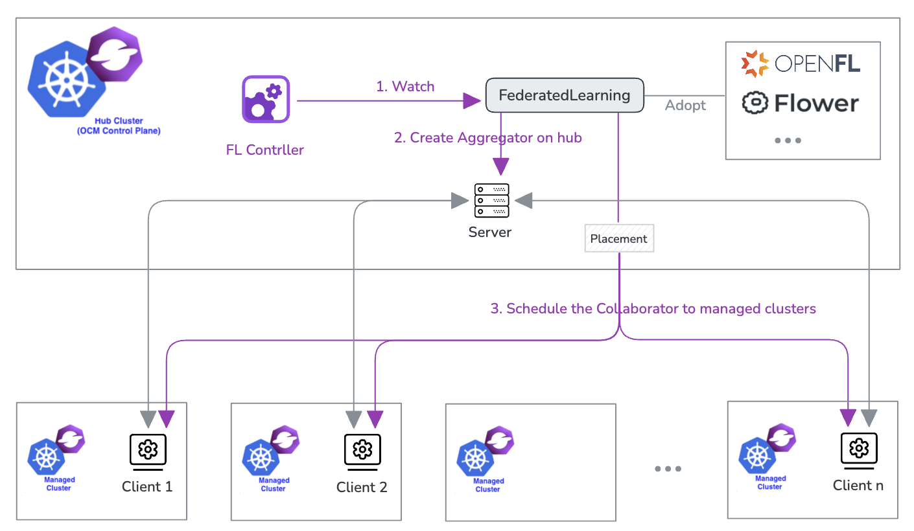

# Federated Learning Controller for Open Cluster Management



This Kubernetes controller orchestrates the startup and management of federated learning processes in an Open Cluster Management environment. The `FederatedLearning` Custom Resource Definition (CRD) defines a federated learning process, supporting frameworks like Flower, OpenFL, and others.

---

## Description


The controller reconciles `FederatedLearning` instances, managing the lifecycle of **server** and **client** components that handle model training and aggregation:

  - **Server**:

    Creates a Kubernetes Job (using a built-in manifest template) expected to start with:

    ```bash
    server --num-rounds <number-of-rounds>
    ```

  - **Client**:
    Creates a Kubernetes Job via ManifestWorks from the hub cluster, expected to start with:

    ```bash
    client --data-config <data-configuration> --server-address <aggregator-address>
    ```

---

This controller simplifies the orchestration of federated learning tasks by leveraging native Kubernetes resources to deploy servers, spawn clients, and coordinate their training processes.

## Getting Started

### Running Locally

**Install the CRDs into the cluster:**

```sh
make install
```

**Run the controller locally:**

```sh
make run
```

### To Deploy on the cluster

**1. Build and push your image to the location specified by `IMG`:**
```sh
make docker-build docker-push IMG=<some-registry>/controller:tag
# or
make docker-build docker-push REGISTRY=<some-registry> 
```
**NOTE:** This image ought to be published in the personal registry you specified.
And it is required to have access to pull the image from the working environment.
Make sure you have the proper permission to the registry if the above commands don’t work.


**2. Deploy the Controller to the cluster**

```sh
make deploy IMG=<some-registry>/controller:tag NAMESPACE=<namespace>
```

> **NOTE**: If you encounter RBAC errors, you may need to grant yourself cluster-admin
privileges or be logged in as admin.

**3. Create a FederatedLearning instance**

```sh
cat <<EOF | oc apply -f -
apiVersion: federation-ai.open-cluster-management.io/v1alpha1
kind: FederatedLearning
metadata:
  name: federated-learning-sample
spec:
  framework: flower
  server:
    image: quay.io/myan/flower-app
    rounds: 10
    minAvailableClients: 2
    listeners:
      - name: server-listener
        port: 8080
        type: LoadBalancer
    storage:
      type: PersistentVolumeClaim
      name: model-pvc
      path: /data/models
      size: 2Gi
  client:
    image: quay.io/myan/flower-app
    placement:
      clusterSets:
        - global
      predicates:
        - requiredClusterSelector:
            claimSelector:
              matchExpressions:
                - key: federated-learning-sample.client-data
                  operator: Exists
EOF
```

**4. Mark the data from the Managed clusters**

```sh
cat <<EOF | oc apply -f -
apiVersion: cluster.open-cluster-management.io/v1alpha1
kind: ClusterClaim
metadata:
  name: federated-learning-sample.client-data
spec:
  value: data-partition-0
EOF
```

## Model Validation

- Validate the model from the pvc by the guide in the [notebook](./notebook/deploy/README.md)

### To Uninstall
**Delete the instances (CRs) from the cluster:**

```sh
kubectl delete -k config/samples/
```

**Delete the APIs(CRDs) from the cluster:**

```sh
make uninstall
```

**UnDeploy the controller from the cluster:**

```sh
make undeploy
```

## Project Distribution

Following are the steps to build the installer and distribute this project to users.

1. Build the installer for the image built and published in the registry:

```sh
make build-installer IMG=<some-registry>/controller:tag
```

NOTE: The makefile target mentioned above generates an 'install.yaml'
file in the dist directory. This file contains all the resources built
with Kustomize, which are necessary to install this project without
its dependencies.

2. Using the installer

Users can just run kubectl apply -f <URL for YAML BUNDLE> to install the project, i.e.:

```sh
kubectl apply -f https://raw.githubusercontent.com/<org>/github/open-cluster-management/federated-learning/<tag or branch>/dist/install.yaml
```

## Contributing
// TODO(user): Add detailed information on how you would like others to contribute to this project

**NOTE:** Run `make help` for more information on all potential `make` targets

More information can be found via the [Kubebuilder Documentation](https://book.kubebuilder.io/introduction.html)

## License

Copyright 2025.

Licensed under the Apache License, Version 2.0 (the "License");
you may not use this file except in compliance with the License.
You may obtain a copy of the License at

    http://www.apache.org/licenses/LICENSE-2.0

Unless required by applicable law or agreed to in writing, software
distributed under the License is distributed on an "AS IS" BASIS,
WITHOUT WARRANTIES OR CONDITIONS OF ANY KIND, either express or implied.
See the License for the specific language governing permissions and
limitations under the License.

