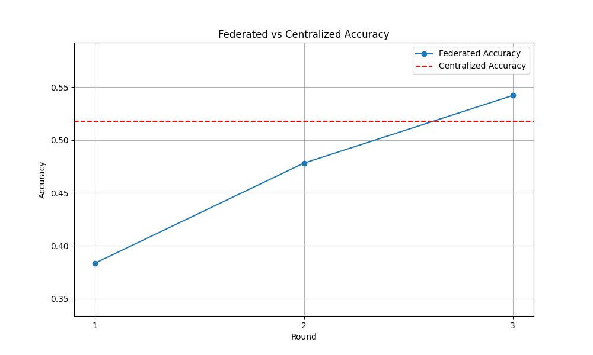

# Flower Example using PyTorch

## Installation

```bash
pip -q install flwr torch torchvision 
```

## Demo

  [](https://asciinema.org/a/669589)

- Define a CNN model and train it with `CIFAR-10` dataset

- DEMO1 - Federated: Set up 2 clients and split the dataset into 2 partitions, with each client training on one partition

- DEMO2 - Centralized: Train the model for 5 epochs on full dataset, using the same hyperparameters as the federated model

  <!--  -->


- Federated learning show a lot of promise

  

## References

- [Get started with Flower](https://flower.ai/docs/framework/tutorial-series-get-started-with-flower-pytorch.html)
- [Flower Example using PyTorch](https://github.com/adap/flower/blob/main/examples/quickstart-pytorch)