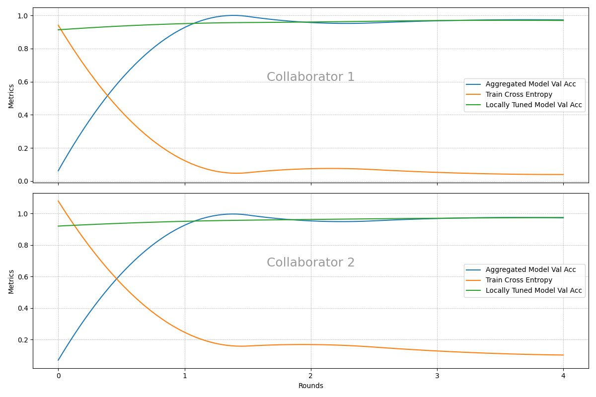

# OpenFL Sample with PyTorch

## Installation

```bash
$ pip -q install openfl
```

## Demo

  [](https://asciinema.org/a/669761)

- Setup Federation Workspace & Certificate Authority (CA) for Secure Communication

  ```bash
  # Create a workspace with a simple PyTorch CNN model that use the MNIST dataset
  $ fx workspace create --template torch_cnn_mnist --prefix mnist_workspace
  $ cd mnist_workspace

  #  Generate CA
  $ fx workspace certify
  ```

- Setup Aggregator & Initialize Federation Plan + Model

  ```bash
  # Initialize the aggregator
  $ fx aggregator generate-cert-request --fqdn localhost
  $ fx aggregator certify --fqdn localhost

  # Initialize FL Plan and Model Weights for the Federation
  $ fx plan initialize -a localhost
  ```

- Setup Collaborator 1

  ```bash
  # Create a collaborator named "collaborator1" that use data path "1"
  $ fx collaborator create -n collaborator1 -d 1

  $ fx collaborator generate-cert-request -n collaborator1

  # The CA signs collaborator1's certificate
  $ fx collaborator certify -n collaborator1
  ```

- Setup Collaborator 2

  ```bash
  # Create a collaborator named "collaborator2" that will use data path "2"
  $ fx collaborator create -n collaborator2 -d 2

  $ fx collaborator generate-cert-request -n collaborator2

  # The CA signs collaborator2's certificate
  $ fx collaborator certify -n collaborator2
  ```

- Check the Collaborators in the Plan

  ```bash
  # Check the Collaborators
  vim plan/cols.yaml
  # Check the Collaborators's Data
  vim plan/data.yaml
  ```

- Run the Federation
  
  ```bash
  $ fx aggregator start

  $ fx collaborator start -n collaborator1

  $ fx collaborator start -n collaborator2
  ```
- Collaborator Metrics

  

## References

- [Go Federated with OpenFL](https://towardsdatascience.com/go-federated-with-openfl-8bc145a5ead1)
- [Aggregator-based Workflow](https://openfl.readthedocs.io/en/latest/about/features_index/taskrunner.html)
- [Federated Learning Plan Setting](https://openfl.readthedocs.io/en/latest/about/features_index/taskrunner.html#federated-learning-plan-fl-plan-settings)